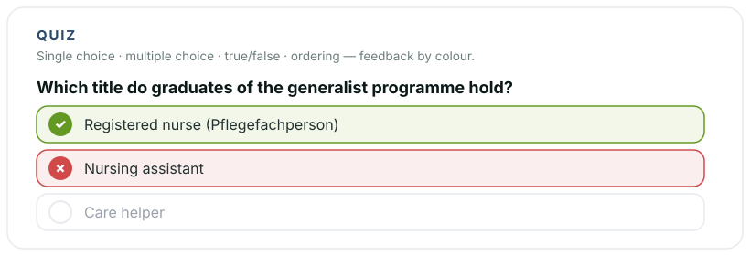

# Reveal-Quiz

[](https://revealjs.com) [](LICENSE)

Interactive exercises for [reveal.js](https://revealjs.com) — **single choice**, **multiple choice**, **true/false**, **ordering** and **matching**. One markup scheme, one `data-type` attribute per exercise. Built for teaching at the board: everything works with a finger on a touch display or smartboard, feedback is shown by colour alone (nothing shifts on the slide), and students can try the same exercises again at home. Standalone (ships its own CSS), colours and labels are easy to theme.

**[Live demo](https://florianloyns.github.io/reveal.js-quiz/demo.html)**

[](https://florianloyns.github.io/reveal.js-quiz/demo.html)

## Installation

**Requires** reveal.js 4.2 or newer. Tested with reveal.js 5.x.

Copy the `quiz` folder into your reveal.js `plugin/` folder — or install from npm.

```console
npm install reveal.js-quiz
```

## Setup

**Regular**

```html
<script src="dist/reveal.js"></script>
<script src="plugin/quiz/quiz.js"></script>
<script>
  Reveal.initialize({ plugins: [ RevealQuiz ] });
</script>
```

**As a module**

```html
<script type="module">
  import Reveal from './dist/reveal.esm.js';
  import RevealQuiz from './plugin/quiz/quiz.esm.js';
  Reveal.initialize({ plugins: [ RevealQuiz ] });
</script>
```

## Usage

Every exercise is a `<div class="quiz" data-type="…">`. Feedback is colour only: green = correct, red = wrong, green outline = correct answer that was missed.

### Single choice

One correct answer, instant feedback on tap. Mark the right option with `data-correct`.

```html
<div class="quiz" data-type="single">
  <div class="quiz-q">Which title do graduates of the generalist programme hold?</div>
  <div class="quiz-options">
    <button class="quiz-opt" data-correct>Registered nurse</button>
    <button class="quiz-opt">Nursing assistant</button>
    <button class="quiz-opt">Care helper</button>
  </div>
</div>
```

### Multiple choice

Several correct answers. The learner selects options and taps **Check**. Missed correct answers are marked with a green outline.

```html
<div class="quiz" data-type="multiple">
  <div class="quiz-q">Which of these are reserved activities?</div>
  <div class="quiz-options">
    <button class="quiz-opt" data-correct>Assessing the care need</button>
    <button class="quiz-opt">Making the beds</button>
    <button class="quiz-opt" data-correct>Steering the care process</button>
  </div>
</div>
```

### True / false

The two buttons are generated for you. For a **single** statement, put `data-answer` on the `.quiz`:

```html
<div class="quiz" data-type="truefalse" data-answer="false">
  <div class="quiz-q">The training contract is signed with the school.</div>
</div>
```

For **several** statements on one slide, use one `.quiz-tf-item` per statement. After an answer the statement holds briefly, then cross-fades to the next — no click needed, and nothing shifts:

```html
<div class="quiz" data-type="truefalse">
  <div class="quiz-tf-item" data-answer="false">
    <div class="quiz-q">The training contract is signed with the school.</div>
  </div>
  <div class="quiz-tf-item" data-answer="true">
    <div class="quiz-q">The probation period lasts six months.</div>
  </div>
</div>
```

### Ordering

Put the items in their **correct** order in the markup (`data-order="1"`, `2`, …) — the plugin shuffles them. To sort, **tap a card** (it lifts), then **tap another card** to swap the two. Tap **Check** to grade, **Reset** to reshuffle. Cards flow in a wrapping grid, so long sequences still fit on one slide.

```html
<div class="quiz" data-type="order">
  <div class="quiz-options">
    <button class="quiz-opt" data-order="1">First step</button>
    <button class="quiz-opt" data-order="2">Second step</button>
    <button class="quiz-opt" data-order="3">Third step</button>
  </div>
</div>
```

### Matching

Sort cards into columns. Name the columns with `data-bins="A|B|C"` on the `.quiz` and give every card the column it belongs to with `data-bin`. The cards start shuffled in a pool above the columns.

To sort, **tap a card** (it lifts and the possible targets are outlined), then **tap a column** to drop it there. Tapping the card a second time cancels the selection; tapping the pool puts a card back. **Check** grades: green = in the right column, red = in the wrong one, orange outline = still in the pool. **Reset** shuffles everything back.

Up to four columns sit side by side; the cards themselves wrap, so a set of a dozen still fits on one slide. Leaving `data-bins` out is allowed — the columns are then collected from the cards' own `data-bin` values, in the order they first appear.

```html
<div class="quiz" data-type="match" data-bins="Nurse|Assistant">
  <div class="quiz-q">Who is allowed to do what? Sort the cards, then Check.</div>
  <div class="quiz-options">
    <button class="quiz-opt" data-bin="Nurse">Assess the care need</button>
    <button class="quiz-opt" data-bin="Nurse">Steer the care process</button>
    <button class="quiz-opt" data-bin="Assistant">Help with washing</button>
    <button class="quiz-opt" data-bin="Assistant">Serve meals</button>
  </div>
</div>
```

## Configuration

All options are optional — for theming the colours and translating the labels.

```js
Reveal.initialize({
  quiz: {
    accent: '#2C4A6E',   // buttons, markers, selection
    ok:     '#639922',   // correct
    bad:    '#D14A4A',   // wrong
    line:   '#E7EBEF',   // resting border
    checkLabel: 'Prüfen',        // the shipped labels are German
    trueLabel:  'Wahr',
    falseLabel: 'Falsch',
    resetLabel: 'Zurücksetzen',
    tfHold: 1200                 // ms a true/false answer stays before cross-fading
  },
  plugins: [ RevealQuiz ]
});
```

| Option | Default | Description |
|---|---|---|
| `accent` | `'#2C4A6E'` | Buttons, order numbers, selection highlight |
| `ok` | `'#639922'` | Correct answers |
| `bad` | `'#D14A4A'` | Wrong answers |
| `line` | `'#E7EBEF'` | Resting option border |
| `checkLabel` | `'Prüfen'` | Label of the check button (multiple / order / match) |
| `trueLabel` | `'Wahr'` | True button label |
| `falseLabel` | `'Falsch'` | False button label |
| `resetLabel` | `'Zurücksetzen'` | Reset button label (order / match) |
| `tfHold` | `1200` | Milliseconds a true/false answer stays before the next fades in |

The shipped labels are German, because that is where the plugin grew up. English, for example:

```js
quiz: { checkLabel: 'Check', trueLabel: 'True', falseLabel: 'False', resetLabel: 'Reset' }
```

## Changelog

**1.3.1** — the action buttons under a **`match`** exercise are centred.

**1.3.0**

- New exercise type **`match`**: sort cards into named columns — the classic classification exercise, and the one that generates the most discussion at the board because a card can be argued about before it is dropped.
- Cards that were never sorted are marked separately from wrong ones, so "didn't get to it" and "got it wrong" stay distinguishable.

**1.2.0**

- **Long-press a question** (~0.6 s) to reset that exercise — handy when the next group comes up to the board.
- The true/false type holds each answer briefly and then cross-fades to the next statement, so nothing shifts on the slide.
- Feedback is announced to screen readers via `aria-label`.

**1.1.0**

- New exercise type **`order`**: tap two cards to swap them, in a wrapping grid so long sequences fit on one slide.

**1.0.0** — initial release with single choice, multiple choice and true/false.

## Like it?

Star the repo.

## Imprint

Responsible: Florian Loyns — [imprint & privacy notice](https://florianloyns.com/Impressum/) (German)

## License

MIT — see [LICENSE](LICENSE). Thanks to Hakim El Hattab (reveal.js).
